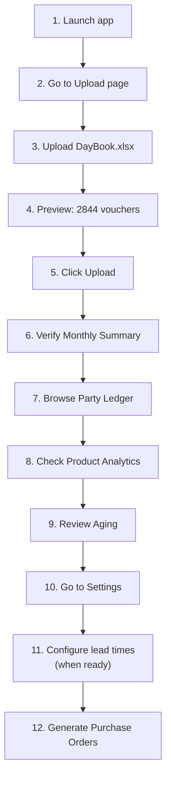

# DayBook Analytics — Complete Execution Plan

## 📊 Project Summary

| Item | Detail |
|------|--------|
| **Business** | Demo Khelauna — toys & party supplies wholesaler |
| **Data** | Tally Day Book export, ~38,800 rows, 2,844 vouchers |
| **Period** | June–September 2026 (4 months) |
| **Products** | 810 unique items across 18 inferred categories |
| **Parties** | 342 unique party names (185 sales, 28 suppliers, 108 receipts) |
| **Suppliers** | 28 purchase sources, 86 products with multiple suppliers |
| **Stack** | Python + Streamlit + Supabase (PostgreSQL) + Plotly |
| **Pages** | 7 dashboard pages |

---

## 🗺️ Execution Phases Overview


---

# Phase 1 — Project Setup & Supabase Schema

## Task 1.1: Project Structure

Create the project directory layout:

```
DayBookAnalytics/
├── DayBook.xlsx              # (existing data file)
├── app.py                    # Main Streamlit app (multi-page)
├── pages/
│   ├── 1_Monthly_Summary.py
│   ├── 2_Party_Ledger.py
│   ├── 3_Product_Analytics.py
│   ├── 4_Aging_Analytics.py
│   ├── 5_Purchase_Orders.py
│   ├── 6_Upload_Data.py
│   └── 7_Settings.py
├── parser.py                 # Excel → DataFrames
├── upload.py                 # DataFrames → Supabase (with dedup)
├── db.py                     # Supabase client + query helpers
├── po_engine.py              # Purchase order suggestion engine
├── schema.sql                # Full Supabase DDL
├── requirements.txt
├── .env                      # SUPABASE_URL, SUPABASE_KEY
└── .gitignore
```

## Task 1.2: `requirements.txt`

```
streamlit>=1.30
pandas>=2.0
openpyxl>=3.1
plotly>=5.18
supabase>=2.0
python-dotenv>=1.0
xlsxwriter>=3.1
```

## Task 1.3: `.env` (template — user fills in credentials)

```env
SUPABASE_URL=https://your-project.supabase.co
SUPABASE_KEY=your-anon-or-service-key
```

## Task 1.4: `.gitignore`

```
.env
__pycache__/
*.pyc
.streamlit/
```

## Task 1.5: `schema.sql` — Complete Supabase DDL

### Deduplication Strategy — How Duplicate Uploads Are Prevented

Since you'll be periodically exporting day books from Tally and uploading them, the system must handle these real-world scenarios cleanly:

| Scenario | What Happens |
|----------|-------------|
| **Same file uploaded twice** | 0 new records inserted, all skipped — you see "2844 skipped, 0 new" |
| **New export with overlapping dates** (e.g., Jun–Sep already loaded, then upload Jun–Dec) | Only Oct–Dec vouchers are inserted; Jun–Sep entries are silently skipped |
| **New period with no overlap** (e.g., Oct–Dec after Jun–Sep) | All new records inserted normally |
| **Tally data corrected** (amounts changed on an existing voucher) | Updated via `ON CONFLICT DO UPDATE` — corrections flow through automatically |

**How it works under the hood:**

Every voucher in Tally has a natural identity: the combination of **date + voucher type + voucher number + party name**. This 4-part key is guaranteed unique (verified against your actual data — 2,844 out of 2,844 unique). When uploading:

1. Each record is inserted with `INSERT ... ON CONFLICT (date, voucher_type, voucher_no, party_name) DO UPDATE SET ...`
2. If the key already exists → amounts and narration are **updated** (in case Tally data was corrected)
3. If the key is new → record is inserted normally
4. The upload summary shows exactly how many were new vs updated vs unchanged

> [!NOTE]
> **Why `party_name` is in the dedup key:** Analysis of your data revealed that `(date, voucher_type, voucher_no)` alone is NOT unique — there are 2 different Purchase vouchers on 2026-06-14 both with voucher number "stock milan" but different amounts (₹5.14L vs ₹19K). Adding `party_name` makes all 2,844 records unique.

> [!NOTE]
> **Why `voucher_no` is TEXT not INTEGER:** 28 of your Purchase vouchers use text-based reference numbers like "rara2603", "Huabei 15", "chirag ji 01" instead of numeric IDs. The schema stores these as TEXT to handle both formats.

8 tables with indexes and constraints:

```sql
-- ============================================
-- TABLE 1: upload_history (CREATE FIRST — referenced by vouchers)
-- ============================================
CREATE TABLE upload_history (
    id              BIGINT GENERATED ALWAYS AS IDENTITY PRIMARY KEY,
    filename        TEXT NOT NULL,
    file_size_bytes BIGINT,
    date_range_start DATE,
    date_range_end  DATE,
    total_vouchers  INTEGER DEFAULT 0,
    new_inserted    INTEGER DEFAULT 0,
    updated         INTEGER DEFAULT 0,
    skipped         INTEGER DEFAULT 0,
    total_line_items INTEGER DEFAULT 0,
    new_products    INTEGER DEFAULT 0,
    status          TEXT DEFAULT 'Success',      -- 'Success', 'Partial', 'Failed'
    error_message   TEXT,
    uploaded_at     TIMESTAMPTZ DEFAULT now()
);

-- ============================================
-- TABLE 2: vouchers (header-level transactions)
-- ============================================
CREATE TABLE vouchers (
    id              BIGINT GENERATED ALWAYS AS IDENTITY PRIMARY KEY,
    date            DATE NOT NULL,
    miti            TEXT,
    party_name      TEXT NOT NULL,
    voucher_type    TEXT NOT NULL,
    voucher_category TEXT NOT NULL,
    voucher_no      TEXT NOT NULL,                -- TEXT: some Tally vch numbers are text (e.g., "rara2603")
    debit_amount    NUMERIC(14,2) DEFAULT 0,
    credit_amount   NUMERIC(14,2) DEFAULT 0,
    narration       TEXT,
    month           TEXT,
    upload_id       BIGINT REFERENCES upload_history(id),
    created_at      TIMESTAMPTZ DEFAULT now(),

    -- DEDUP KEY: date + type + number + party = truly unique voucher
    CONSTRAINT uq_voucher UNIQUE (date, voucher_type, voucher_no, party_name)
);
CREATE INDEX idx_vouchers_date ON vouchers(date);
CREATE INDEX idx_vouchers_party ON vouchers(party_name);
CREATE INDEX idx_vouchers_type ON vouchers(voucher_type);
CREATE INDEX idx_vouchers_month ON vouchers(month);
CREATE INDEX idx_vouchers_category ON vouchers(voucher_category);

-- ============================================
-- TABLE 3: line_items (product-level details)
-- ============================================
CREATE TABLE line_items (
    id              BIGINT GENERATED ALWAYS AS IDENTITY PRIMARY KEY,
    voucher_id      BIGINT REFERENCES vouchers(id) ON DELETE CASCADE,
    date            DATE NOT NULL,
    party_name      TEXT NOT NULL,
    voucher_type    TEXT NOT NULL,
    voucher_category TEXT NOT NULL,
    voucher_no      TEXT NOT NULL,
    product_name    TEXT NOT NULL,
    quantity        NUMERIC(12,2) DEFAULT 0,
    rate            NUMERIC(12,2) DEFAULT 0,
    amount          NUMERIC(14,2) DEFAULT 0,
    month           TEXT,
    product_group   TEXT DEFAULT 'Others',
    created_at      TIMESTAMPTZ DEFAULT now(),

    -- DEDUP KEY: same voucher identity + same product + same qty + same rate
    CONSTRAINT uq_line_item UNIQUE (date, voucher_type, voucher_no, party_name, product_name, quantity, rate)
);
CREATE INDEX idx_line_items_product ON line_items(product_name);
CREATE INDEX idx_line_items_group ON line_items(product_group);
CREATE INDEX idx_line_items_voucher ON line_items(voucher_id);
CREATE INDEX idx_line_items_month ON line_items(month);
CREATE INDEX idx_line_items_date ON line_items(date);

-- ============================================
-- TABLE 4: narrations
-- ============================================
CREATE TABLE narrations (
    id              BIGINT GENERATED ALWAYS AS IDENTITY PRIMARY KEY,
    voucher_id      BIGINT REFERENCES vouchers(id) ON DELETE CASCADE,
    narration_text  TEXT NOT NULL,
    created_at      TIMESTAMPTZ DEFAULT now(),
    CONSTRAINT uq_narration UNIQUE (voucher_id, narration_text)
);

-- ============================================
-- TABLE 5: supplier_products (auto-populated)
-- ============================================
CREATE TABLE supplier_products (
    id                  BIGINT GENERATED ALWAYS AS IDENTITY PRIMARY KEY,
    supplier_name       TEXT NOT NULL,
    product_name        TEXT NOT NULL,
    last_purchase_date  DATE,
    last_purchase_rate  NUMERIC(12,2),
    avg_purchase_rate   NUMERIC(12,2),
    total_qty_purchased NUMERIC(12,2) DEFAULT 0,
    purchase_count      INTEGER DEFAULT 0,
    is_preferred        BOOLEAN DEFAULT FALSE,
    created_at          TIMESTAMPTZ DEFAULT now(),
    updated_at          TIMESTAMPTZ DEFAULT now(),
    CONSTRAINT uq_supplier_product UNIQUE (supplier_name, product_name)
);
CREATE INDEX idx_sp_supplier ON supplier_products(supplier_name);
CREATE INDEX idx_sp_product ON supplier_products(product_name);

-- ============================================
-- TABLE 6: lead_time_config
-- ============================================
CREATE TABLE lead_time_config (
    id                      BIGINT GENERATED ALWAYS AS IDENTITY PRIMARY KEY,
    config_type             TEXT NOT NULL,       -- 'supplier', 'product_group', 'default'
    config_key              TEXT NOT NULL,       -- supplier name, group name, or 'global'
    lead_time_days          INTEGER NOT NULL DEFAULT 7,
    safety_stock_days       INTEGER NOT NULL DEFAULT 3,
    min_order_qty           NUMERIC(12,2) DEFAULT 1,
    reorder_point_override  NUMERIC(12,2),
    notes                   TEXT,
    updated_at              TIMESTAMPTZ DEFAULT now(),
    CONSTRAINT uq_lead_time UNIQUE (config_type, config_key)
);
-- Seed global default
INSERT INTO lead_time_config (config_type, config_key, lead_time_days, safety_stock_days)
VALUES ('default', 'global', 7, 3);

-- ============================================
-- TABLE 7: purchase_orders
-- ============================================
CREATE TABLE purchase_orders (
    id              BIGINT GENERATED ALWAYS AS IDENTITY PRIMARY KEY,
    po_number       TEXT NOT NULL UNIQUE,
    supplier_name   TEXT NOT NULL,
    status          TEXT NOT NULL DEFAULT 'Draft',
    total_amount    NUMERIC(14,2) DEFAULT 0,
    total_items     INTEGER DEFAULT 0,
    notes           TEXT,
    created_at      TIMESTAMPTZ DEFAULT now(),
    updated_at      TIMESTAMPTZ DEFAULT now()
);

-- ============================================
-- TABLE 8: po_line_items
-- ============================================
CREATE TABLE po_line_items (
    id              BIGINT GENERATED ALWAYS AS IDENTITY PRIMARY KEY,
    po_id           BIGINT REFERENCES purchase_orders(id) ON DELETE CASCADE,
    product_name    TEXT NOT NULL,
    suggested_qty   NUMERIC(12,2) NOT NULL,
    ordered_qty     NUMERIC(12,2) NOT NULL,
    estimated_rate  NUMERIC(12,2),
    estimated_amount NUMERIC(14,2),
    sales_velocity  NUMERIC(12,4),
    current_stock   NUMERIC(12,2),
    days_of_stock   NUMERIC(8,2),
    product_group   TEXT,
    created_at      TIMESTAMPTZ DEFAULT now()
);
```

> [!IMPORTANT]
> Run `schema.sql` in your Supabase SQL Editor **before** proceeding to Phase 3. Create tables in order listed — `upload_history` first since `vouchers` references it.

---

# Phase 2 — Data Parser (`parser.py`)

## Task 2.1: Core Parsing Algorithm

The Tally Day Book has a **hierarchical multi-row format**. Each voucher is a block of rows that must be walked sequentially.

### Parsing Logic (detailed pseudocode)

```python
def parse_daybook(filepath: str) -> tuple[pd.DataFrame, pd.DataFrame]:
    """
    Returns (vouchers_df, line_items_df)
    """
    df = pd.read_excel(filepath, sheet_name='Day Book', header=None)
    
    vouchers = []
    line_items = []
    
    # Walk every row from index 5 (skip headers 0-4) to second-to-last
    # (last rows are totals: "Day Book Total :", "Cash :", "Bank :")
    
    current_voucher = None
    
    for i in range(5, len(df)):
        row = df.iloc[i]
        
        # DETECT VOUCHER HEADER: col 0 has a datetime AND col 7 has a voucher type
        if isinstance(row[0], datetime) and pd.notna(row[7]) and row[7] != 'Vch Type':
            
            # Save previous voucher if exists
            if current_voucher:
                vouchers.append(current_voucher)
            
            # Start new voucher
            current_voucher = {
                'date': row[0].date(),
                'miti': str(row[1]) if pd.notna(row[1]) else None,
                'party_name': str(row[2]).strip() if pd.notna(row[2]) else 'Unknown',
                'voucher_type': str(row[7]).strip(),
                'voucher_category': classify_voucher_type(row[7]),
                'voucher_no': safe_int(row[8]),
                'debit_amount': safe_float(row[9]),
                'credit_amount': safe_float(row[10]),
                'narration_parts': [],
                'products': [],
            }
            continue
        
        # SKIP if no current voucher context
        if current_voucher is None:
            continue
            
        # DETECT PRODUCT LINE: col 1 has text, col 4 has numeric amount
        # Exclude known non-product patterns
        if (pd.notna(row[1]) and pd.notna(row[4])
            and str(row[1]).strip() not in SKIP_NAMES
            and is_numeric(row[4])):
            
            current_voucher['products'].append({
                'product_name': str(row[1]).strip(),
                'quantity': safe_float(row[2]),
                'rate': safe_float(row[3]),
                'amount': safe_float(row[4]),
            })
            continue
        
        # DETECT NARRATION: col 1 has text, col 2-4 are empty/non-numeric
        # (not "On Account", not A/c line, not Cheque/DD)
        if (pd.notna(row[1])
            and str(row[1]).strip() not in ['On Account', 'NaN']
            and not str(row[1]).strip().startswith('On Account')
            and pd.isna(row[0])
            and not is_product_line(row)):
            
            narr = str(row[1]).strip()
            if narr and 'A/c' not in narr:
                current_voucher['narration_parts'].append(narr)
    
    # Don't forget the last voucher
    if current_voucher:
        vouchers.append(current_voucher)
    
    # Build DataFrames
    vouchers_df = build_vouchers_df(vouchers)      # flatten + add month
    line_items_df = build_line_items_df(vouchers)   # flatten products + assign groups
    
    return vouchers_df, line_items_df
```

### Key Helper Functions

```python
SKIP_NAMES = {'On Account', 'NaN', 'Cheque/DD', 'Claim', ''}

VOUCHER_CATEGORY_MAP = {
    'Head Office Sales': 'Sales',
    'Bafal Sales':       'Sales',
    'Pasal':             'Sales',
    'Sales':             'Sales',
    'Purchase':          'Purchase',
    'Payment':           'Payment',
    'Receipt':           'Receipt',
    'Credit Note':       'Credit Note',
    'Stock Journal':     'Stock Transfer',
}

def classify_voucher_type(vtype: str) -> str:
    return VOUCHER_CATEGORY_MAP.get(str(vtype).strip(), 'Other')

def safe_float(val) -> float:
    try: return float(val)
    except: return 0.0

def safe_int(val) -> int:
    try: return int(float(val))
    except: return 0
```

## Task 2.2: Product Group Assignment

Keyword-based classification for 810 products. **18 groups** with fallback to "Others":

```python
PRODUCT_GROUP_RULES = [
    ('Balloons',           ['ballon', 'balloon']),
    ('Balls',              ['ball', 'football']),
    ('Bubbles',            ['bubble']),
    ('Candles',            ['candle', 'candel']),
    ('Caps & Party',       ['cap', 'banner', 'sashi', 'birthday', 'anniversary']),
    ('Cars & Vehicles',    ['car', 'jeep', 'bus', 'tempo', 'ambulance', 'thar', 'rider', 'truck']),
    ('Clay & Slime',       ['clay', 'slime']),
    ('Cycles & Bikes',     ['cycle', 'bike', 'scooty', 'scooter']),
    ('Dolls & Figures',    ['doll', 'barbie', 'figure', 'character']),
    ('Factory Items',      ['factory']),
    ('Guns',               ['gun', 'bullet']),
    ('Kitchen & Home',     ['kitchen', 'table', 'cloth', 'curtain']),
    ('Musical',            ['guitar', 'piano', 'music', 'drum']),
    ('Blocks & Puzzles',   ['block', 'puzzle', 'lego']),
    ('Remote Control',     ['r/c', 'rc ']),
    ('Rings & Accessories',['ring', 'mala', 'watch']),
    ('Water Toys',         ['water', 'pani']),
    ('Books & Stationery', ['book', 'stationery', 'pencil']),
]

def assign_product_group(product_name: str) -> str:
    name_lower = product_name.lower()
    for group, keywords in PRODUCT_GROUP_RULES:
        if any(kw in name_lower for kw in keywords):
            return group
    return 'Others'
```

> [!NOTE]
> Current coverage: **~420 products** auto-categorized, **~390 in "Others"**. The Others category contains mostly code-named items (e.g., "022", "1207", "168-15") which are Tally item codes. Users can reassign these in the Settings page.

## Task 2.3: Duplicate Line Aggregation

Before building `line_items_df`, aggregate duplicates within the same voucher:

```python
def aggregate_duplicate_lines(products: list[dict]) -> list[dict]:
    """Merge lines with same product_name within a single voucher."""
    merged = {}
    for p in products:
        key = p['product_name']
        if key in merged:
            merged[key]['quantity'] += p['quantity']
            merged[key]['amount'] += p['amount']
            # Keep the rate from the first occurrence
        else:
            merged[key] = p.copy()
    return list(merged.values())
```

## Task 2.4: Build Output DataFrames

```python
def build_vouchers_df(vouchers: list[dict]) -> pd.DataFrame:
    records = []
    for v in vouchers:
        records.append({
            'date': v['date'],
            'miti': v['miti'],
            'party_name': v['party_name'],
            'voucher_type': v['voucher_type'],
            'voucher_category': v['voucher_category'],
            'voucher_no': v['voucher_no'],
            'debit_amount': v['debit_amount'],
            'credit_amount': v['credit_amount'],
            'narration': ' | '.join(v['narration_parts']) if v['narration_parts'] else None,
            'month': v['date'].strftime('%Y-%m'),
        })
    return pd.DataFrame(records)

def build_line_items_df(vouchers: list[dict]) -> pd.DataFrame:
    records = []
    for v in vouchers:
        products = aggregate_duplicate_lines(v['products'])
        for p in products:
            records.append({
                'date': v['date'],
                'party_name': v['party_name'],
                'voucher_type': v['voucher_type'],
                'voucher_category': v['voucher_category'],
                'voucher_no': v['voucher_no'],
                'product_name': p['product_name'],
                'quantity': p['quantity'],
                'rate': p['rate'],
                'amount': p['amount'],
                'month': v['date'].strftime('%Y-%m'),
                'product_group': assign_product_group(p['product_name']),
            })
    return pd.DataFrame(records)
```

### Expected Output Shapes

| DataFrame | Est. Rows | Columns |
|-----------|-----------|---------|
| `vouchers_df` | ~2,844 | 10 |
| `line_items_df` | ~13,000+ | 11 |

---

# Phase 3 — Supabase Integration

## Task 3.1: `db.py` — Client & Query Helpers

```python
import os
from supabase import create_client, Client
from dotenv import load_dotenv

load_dotenv()

def get_client() -> Client:
    return create_client(
        os.getenv('SUPABASE_URL'),
        os.getenv('SUPABASE_KEY')
    )

# ---------- READ QUERIES ----------

def get_monthly_summary() -> pd.DataFrame:
    """Aggregate debit/credit by month and voucher_category."""
    client = get_client()
    data = client.table('vouchers') \
        .select('month, voucher_category, debit_amount, credit_amount') \
        .execute()
    df = pd.DataFrame(data.data)
    return df.groupby(['month', 'voucher_category']).agg(
        total_debit=('debit_amount', 'sum'),
        total_credit=('credit_amount', 'sum'),
        count=('month', 'count')
    ).reset_index()

def get_party_ledger(party_name: str = None) -> pd.DataFrame:
    """Get all vouchers for a party, sorted by date."""
    client = get_client()
    query = client.table('vouchers') \
        .select('*') \
        .order('date', desc=False) \
        .order('voucher_no', desc=False)
    if party_name:
        query = query.eq('party_name', party_name)
    data = query.execute()
    return pd.DataFrame(data.data)

def get_all_parties() -> list[str]:
    """Get distinct party names."""
    client = get_client()
    data = client.table('vouchers') \
        .select('party_name') \
        .execute()
    return sorted(set(r['party_name'] for r in data.data))

def get_product_analytics(group: str = None) -> pd.DataFrame:
    """Aggregate product sales data."""
    client = get_client()
    query = client.table('line_items') \
        .select('*') \
        .in_('voucher_category', ['Sales'])
    if group and group != 'All':
        query = query.eq('product_group', group)
    data = query.execute()
    df = pd.DataFrame(data.data)
    if df.empty:
        return df
    return df.groupby(['product_name', 'product_group']).agg(
        total_qty=('quantity', 'sum'),
        total_revenue=('amount', 'sum'),
        avg_rate=('rate', 'mean'),
        transactions=('product_name', 'count')
    ).reset_index()

def get_product_groups() -> list[str]:
    """Get distinct product groups."""
    client = get_client()
    data = client.table('line_items') \
        .select('product_group') \
        .execute()
    return sorted(set(r['product_group'] for r in data.data))

def get_aging_data() -> pd.DataFrame:
    """Get purchase vs sales quantities per product for aging calc."""
    client = get_client()
    data = client.table('line_items') \
        .select('product_name, product_group, voucher_category, quantity, date') \
        .in_('voucher_category', ['Sales', 'Purchase']) \
        .execute()
    return pd.DataFrame(data.data)

def get_supplier_products() -> pd.DataFrame:
    client = get_client()
    data = client.table('supplier_products').select('*').execute()
    return pd.DataFrame(data.data)

def get_lead_time_config() -> pd.DataFrame:
    client = get_client()
    data = client.table('lead_time_config').select('*').execute()
    return pd.DataFrame(data.data)

def get_purchase_orders() -> pd.DataFrame:
    client = get_client()
    data = client.table('purchase_orders').select('*').order('created_at', desc=True).execute()
    return pd.DataFrame(data.data)
```

## Task 3.2: `upload.py` — Upsert with Deduplication

```python
def upload_vouchers(vouchers_df: pd.DataFrame) -> dict:
    """
    Upload vouchers to Supabase.
    Uses ON CONFLICT DO NOTHING via the unique constraint.
    Returns {'inserted': N, 'skipped': M}
    """
    client = get_client()
    records = vouchers_df.to_dict('records')
    
    # Convert date objects to ISO strings for JSON serialization
    for r in records:
        r['date'] = str(r['date'])
    
    inserted = 0
    skipped = 0
    
    # Batch upsert in chunks of 500
    for batch in chunked(records, 500):
        try:
            result = client.table('vouchers').upsert(
                batch,
                on_conflict='date,voucher_type,voucher_no',
                ignore_duplicates=True         # ON CONFLICT DO NOTHING
            ).execute()
            inserted += len(result.data)
        except Exception as e:
            # Count duplicates as skipped
            skipped += len(batch)
    
    skipped = len(records) - inserted
    return {'inserted': inserted, 'skipped': skipped, 'total': len(records)}

def upload_line_items(line_items_df: pd.DataFrame, voucher_id_map: dict) -> dict:
    """
    Upload line items with FK to vouchers.
    voucher_id_map: {(date, voucher_type, voucher_no): voucher_id}
    """
    client = get_client()
    records = line_items_df.to_dict('records')
    
    for r in records:
        r['date'] = str(r['date'])
        key = (r['date'], r['voucher_type'], r['voucher_no'])
        r['voucher_id'] = voucher_id_map.get(key)
    
    inserted = 0
    for batch in chunked(records, 500):
        try:
            result = client.table('line_items').upsert(
                batch,
                on_conflict='date,voucher_type,voucher_no,product_name,quantity,rate',
                ignore_duplicates=True
            ).execute()
            inserted += len(result.data)
        except Exception:
            pass
    
    return {'inserted': inserted, 'total': len(records)}

def build_voucher_id_map() -> dict:
    """Fetch all voucher IDs to build FK lookup."""
    client = get_client()
    data = client.table('vouchers') \
        .select('id, date, voucher_type, voucher_no') \
        .execute()
    return {
        (r['date'], r['voucher_type'], r['voucher_no']): r['id']
        for r in data.data
    }

def update_supplier_products(line_items_df: pd.DataFrame):
    """Auto-populate supplier_products from Purchase line items."""
    purchases = line_items_df[line_items_df['voucher_category'] == 'Purchase']
    if purchases.empty:
        return
    
    supplier_agg = purchases.groupby(['party_name', 'product_name']).agg(
        last_purchase_date=('date', 'max'),
        last_purchase_rate=('rate', 'last'),
        avg_purchase_rate=('rate', 'mean'),
        total_qty_purchased=('quantity', 'sum'),
        purchase_count=('product_name', 'count'),
    ).reset_index()
    
    supplier_agg.rename(columns={'party_name': 'supplier_name'}, inplace=True)
    
    client = get_client()
    records = supplier_agg.to_dict('records')
    for r in records:
        r['last_purchase_date'] = str(r['last_purchase_date'])
    
    client.table('supplier_products').upsert(
        records,
        on_conflict='supplier_name,product_name'
    ).execute()

def full_upload_pipeline(filepath: str, progress_callback=None) -> dict:
    """Complete upload: parse → upsert vouchers → upsert items → update suppliers."""
    from parser import parse_daybook
    
    if progress_callback: progress_callback(0.1, "Parsing Excel file...")
    vouchers_df, line_items_df = parse_daybook(filepath)
    
    if progress_callback: progress_callback(0.3, "Uploading vouchers...")
    v_result = upload_vouchers(vouchers_df)
    
    if progress_callback: progress_callback(0.5, "Building voucher ID map...")
    id_map = build_voucher_id_map()
    
    if progress_callback: progress_callback(0.6, "Uploading line items...")
    li_result = upload_line_items(line_items_df, id_map)
    
    if progress_callback: progress_callback(0.8, "Updating supplier mappings...")
    update_supplier_products(line_items_df)
    
    if progress_callback: progress_callback(1.0, "Done!")
    
    return {
        'vouchers': v_result,
        'line_items': li_result,
        'total_products': line_items_df['product_name'].nunique(),
        'total_suppliers': line_items_df[
            line_items_df['voucher_category'] == 'Purchase'
        ]['party_name'].nunique(),
    }
```

---

# Phase 4 — Core Dashboard Pages

## Task 4.1: `app.py` — Main App Shell

```python
import streamlit as st

st.set_page_config(
    page_title="DayBook Analytics — Demo Khelauna",
    page_icon="📊",
    layout="wide",
    initial_sidebar_state="expanded",
)

st.title("📊 DayBook Analytics")
st.caption("Demo Khelauna — Toys & Party Supplies")

st.markdown("""
### Welcome! Select a page from the sidebar to get started.

| Page | Description |
|------|-------------|
| 📈 Monthly Summary | Sales, purchases, expenses by month |
| 📒 Party Ledger | Party-wise transactions with narrations |
| 📦 Product Analytics | Product table with group filters |
| ⏳ Aging Analytics | Stock aging & slow-moving products |
| 🛒 Purchase Orders | Smart PO suggestions based on trends |
| 📤 Upload Data | Import new DayBook files |
| ⚙️ Settings | Lead times, groups, suppliers |
""")
```

## Task 4.2: Page 1 — Monthly Summary (`pages/1_Monthly_Summary.py`)

### Layout & Widgets

```
┌─────────────────────────────────────────────────────────┐
│  📈 Monthly Summary                                     │
│                                                         │
│  Month Filter: [☑ Jun] [☑ Jul] [☑ Aug] [☑ Sep]         │
│                                                         │
│  ┌──────────┐ ┌──────────┐ ┌──────────┐ ┌──────────┐   │
│  │ Total    │ │ Total    │ │ Total    │ │ Total    │   │
│  │ Sales    │ │ Purchase │ │ Payments │ │ Receipts │   │
│  │ ₹1.2 Cr  │ │ ₹85 L   │ │ ₹45 L   │ │ ₹90 L   │   │
│  └──────────┘ └──────────┘ └──────────┘ └──────────┘   │
│                                                         │
│  ┌─────────────────────────────────────────────────┐    │
│  │ Monthly Bar Chart (Plotly)                       │    │
│  │ Sales vs Purchases vs Payments by month          │    │
│  └─────────────────────────────────────────────────┘    │
│                                                         │
│  ┌─────────────────────────────────────────────────┐    │
│  │ Daily Sales Trend Line (Plotly)                   │    │
│  └─────────────────────────────────────────────────┘    │
│                                                         │
│  ┌─────────────────────────────────────────────────┐    │
│  │ Detailed Breakdown Table                         │    │
│  │ Month | Sales | Purchase | Payment | Receipt ... │    │
│  └─────────────────────────────────────────────────┘    │
└─────────────────────────────────────────────────────────┘
```

### Implementation Logic

```python
# Fetch from Supabase
summary = db.get_monthly_summary()

# KPI cards using st.columns(4)
col1, col2, col3, col4 = st.columns(4)
col1.metric("Total Sales", format_inr(total_sales))
col2.metric("Total Purchases", format_inr(total_purchases))
# ...

# Monthly grouped bar chart
fig = px.bar(summary, x='month', y='total', color='voucher_category',
             barmode='group', title='Monthly Breakdown')

# Daily trend
daily = vouchers_df.groupby('date')['debit_amount'].sum().reset_index()
fig2 = px.line(daily, x='date', y='debit_amount', title='Daily Sales Trend')
```

## Task 4.3: Page 2 — Party Ledger (`pages/2_Party_Ledger.py`)

### Layout

```
┌─────────────────────────────────────────────────────────┐
│  📒 Party Ledger                                         │
│                                                         │
│  Sidebar:                                               │
│  ┌──────────────────┐                                   │
│  │ Search Party:     │                                   │
│  │ [______________ ] │                                   │
│  │ Date Range:       │                                   │
│  │ [Jun 13] to [Sep] │                                   │
│  │ Vch Type: [All ▾] │                                   │
│  └──────────────────┘                                   │
│                                                         │
│  ┌──────────┐ ┌──────────┐ ┌──────────┐                │
│  │ Total Dr │ │ Total Cr │ │ Balance  │                │
│  │ ₹5,40,000│ │ ₹4,80,000│ │ ₹60,000  │                │
│  └──────────┘ └──────────┘ └──────────┘                │
│                                                         │
│  ┌─────────────────────────────────────────────────┐    │
│  │ Date    │ Type    │ Vch# │ Dr     │ Cr    │ Bal │    │
│  │ Jun 13  │ H.O.S   │ 5    │ 54,000 │       │ 54k │    │
│  │         │ Narr: "06-01-2026 sujit jawalakhel"   │    │
│  │ Jun 18  │ Receipt │ 27   │        │ 50,000│  4k │    │
│  │         │ Narr: "cheque payment"                │    │
│  │ ...                                              │    │
│  └─────────────────────────────────────────────────┘    │
│                                                         │
│  ┌─────────────────────────────────────────────────┐    │
│  │ All Parties Summary Table (sortable)             │    │
│  │ Party | Total Dr | Total Cr | Balance | # Txns   │    │
│  └─────────────────────────────────────────────────┘    │
└─────────────────────────────────────────────────────────┘
```

### Running Balance Calculation

```python
def compute_running_balance(ledger_df: pd.DataFrame) -> pd.DataFrame:
    """Add running_balance column to a party's sorted ledger."""
    ledger_df = ledger_df.sort_values(['date', 'voucher_no'])
    ledger_df['debit_amount'] = ledger_df['debit_amount'].fillna(0)
    ledger_df['credit_amount'] = ledger_df['credit_amount'].fillna(0)
    ledger_df['running_balance'] = (
        ledger_df['debit_amount'] - ledger_df['credit_amount']
    ).cumsum()
    return ledger_df
```

## Task 4.4: Page 3 — Product Analytics (`pages/3_Product_Analytics.py`)

### Group Filter Buttons

```python
# Get all groups
groups = ['All'] + db.get_product_groups()

# Render as horizontal button row
cols = st.columns(len(groups))
selected_group = 'All'
for i, group in enumerate(groups):
    if cols[i].button(group, key=f'grp_{group}',
                      type='primary' if group == selected_group else 'secondary'):
        selected_group = group
        st.session_state['selected_group'] = group

# Alternatively, use st.radio with horizontal layout
selected_group = st.radio(
    "Product Group",
    groups,
    horizontal=True,
    key='product_group_filter'
)

# Fetch filtered data
products = db.get_product_analytics(group=selected_group)

# Display sortable table
st.dataframe(
    products[['product_name', 'total_qty', 'total_revenue', 'avg_rate', 'transactions']],
    use_container_width=True,
    column_config={
        'product_name': 'Product',
        'total_qty': st.column_config.NumberColumn('Total Qty', format='%.0f'),
        'total_revenue': st.column_config.NumberColumn('Revenue (₹)', format='₹%.2f'),
        'avg_rate': st.column_config.NumberColumn('Avg Rate', format='₹%.2f'),
        'transactions': '# Sales',
    }
)
```

### Product Detail View

```python
selected = st.selectbox("Select product for details", products['product_name'].unique())
if selected:
    # Monthly sales chart for this product
    product_data = line_items[line_items['product_name'] == selected]
    monthly = product_data.groupby('month').agg(qty=('quantity','sum'), rev=('amount','sum'))
    fig = px.bar(monthly, x=monthly.index, y='rev', title=f'{selected} — Monthly Sales')
    st.plotly_chart(fig)
    
    # Buyer breakdown
    buyers = product_data.groupby('party_name')['amount'].sum().sort_values(ascending=False)
    st.dataframe(buyers.reset_index(), use_container_width=True)
```

## Task 4.5: Page 4 — Aging Analytics (`pages/4_Aging_Analytics.py`)

### Aging Calculation Logic

```python
from datetime import date

def calculate_aging(line_items_df: pd.DataFrame, as_of_date: date = None) -> pd.DataFrame:
    """
    Calculate stock aging per product.
    Stock = total purchased qty - total sold qty (within data period)
    """
    if as_of_date is None:
        as_of_date = date.today()
    
    # Separate purchases and sales
    purchases = line_items_df[line_items_df['voucher_category'] == 'Purchase']
    sales = line_items_df[line_items_df['voucher_category'] == 'Sales']
    
    # Aggregate by product
    purch_agg = purchases.groupby('product_name').agg(
        qty_purchased=('quantity', 'sum'),
        last_purchase=('date', 'max'),
        purchase_count=('product_name', 'count'),
    ).reset_index()
    
    sales_agg = sales.groupby('product_name').agg(
        qty_sold=('quantity', 'sum'),
        last_sale=('date', 'max'),
        sale_count=('product_name', 'count'),
    ).reset_index()
    
    # Merge
    aging = purch_agg.merge(sales_agg, on='product_name', how='left')
    aging['qty_sold'] = aging['qty_sold'].fillna(0)
    aging['est_stock'] = aging['qty_purchased'] - aging['qty_sold']
    
    # Days since last sale
    aging['last_sale'] = pd.to_datetime(aging['last_sale'])
    aging['days_since_sale'] = aging['last_sale'].apply(
        lambda d: (as_of_date - d.date()).days if pd.notna(d) else 9999
    )
    
    # Aging buckets
    aging['aging_bucket'] = aging['days_since_sale'].apply(
        lambda d: '0-30 days' if d <= 30
        else '31-60 days' if d <= 60
        else '61-90 days' if d <= 90
        else '90+ days' if d < 9999
        else 'Never Sold'
    )
    
    # Add product group
    aging['product_group'] = aging['product_name'].apply(assign_product_group)
    
    return aging.sort_values('days_since_sale', ascending=False)
```

### Display

```python
# Aging summary pie chart
bucket_counts = aging['aging_bucket'].value_counts()
fig = px.pie(values=bucket_counts.values, names=bucket_counts.index,
             title='Products by Aging Bucket')

# Alert panels
critical = aging[(aging['est_stock'] > 0) & (aging['days_since_sale'] > 60)]
st.warning(f"⚠️ {len(critical)} products with stock but no sales in 60+ days")

dead = aging[aging['days_since_sale'] == 9999]
st.error(f"🔴 {len(dead)} products purchased but NEVER sold")

# Full table
st.dataframe(aging, use_container_width=True)
```

---

# Phase 5 — Purchase Order System

## Task 5.1: `po_engine.py` — Sales Velocity & Reorder Engine

```python
from datetime import date, timedelta

def calculate_sales_velocity(
    line_items_df: pd.DataFrame,
    lookback_days: int = 30,
    as_of_date: date = None
) -> pd.DataFrame:
    """
    Calculate average daily sales per product over the lookback window.
    
    Returns DataFrame with columns:
      product_name, product_group, total_qty_sold, selling_days,
      daily_velocity, weekly_velocity
    """
    if as_of_date is None:
        as_of_date = date.today()
    
    cutoff = as_of_date - timedelta(days=lookback_days)
    
    sales = line_items_df[
        (line_items_df['voucher_category'] == 'Sales') &
        (pd.to_datetime(line_items_df['date']).dt.date >= cutoff)
    ]
    
    velocity = sales.groupby(['product_name', 'product_group']).agg(
        total_qty_sold=('quantity', 'sum'),
        total_revenue=('amount', 'sum'),
        selling_days=('date', 'nunique'),
        last_sale=('date', 'max'),
    ).reset_index()
    
    velocity['daily_velocity'] = velocity['total_qty_sold'] / lookback_days
    velocity['weekly_velocity'] = velocity['daily_velocity'] * 7
    
    return velocity


def estimate_current_stock(line_items_df: pd.DataFrame) -> pd.DataFrame:
    """Estimate stock = total purchased - total sold."""
    purchases = line_items_df[line_items_df['voucher_category'] == 'Purchase'] \
        .groupby('product_name')['quantity'].sum().rename('qty_purchased')
    
    sales = line_items_df[line_items_df['voucher_category'] == 'Sales'] \
        .groupby('product_name')['quantity'].sum().rename('qty_sold')
    
    stock = pd.DataFrame({'qty_purchased': purchases, 'qty_sold': sales}).fillna(0)
    stock['est_stock'] = stock['qty_purchased'] - stock['qty_sold']
    
    return stock.reset_index()


def get_lead_time(product_name: str, supplier: str, config_df: pd.DataFrame,
                  product_group: str = 'Others') -> tuple[int, int]:
    """
    Get lead time and safety stock for a product.
    Priority: product_group config > supplier config > global default
    """
    # Check product group config
    group_cfg = config_df[
        (config_df['config_type'] == 'product_group') &
        (config_df['config_key'] == product_group)
    ]
    if not group_cfg.empty:
        r = group_cfg.iloc[0]
        return int(r['lead_time_days']), int(r['safety_stock_days'])
    
    # Check supplier config
    sup_cfg = config_df[
        (config_df['config_type'] == 'supplier') &
        (config_df['config_key'] == supplier)
    ]
    if not sup_cfg.empty:
        r = sup_cfg.iloc[0]
        return int(r['lead_time_days']), int(r['safety_stock_days'])
    
    # Global default
    default = config_df[config_df['config_type'] == 'default']
    if not default.empty:
        r = default.iloc[0]
        return int(r['lead_time_days']), int(r['safety_stock_days'])
    
    return 7, 3  # hardcoded fallback


def generate_po_suggestions(
    line_items_df: pd.DataFrame,
    supplier_products_df: pd.DataFrame,
    lead_time_config_df: pd.DataFrame,
    lookback_days: int = 30,
    cover_days: int = 30,
) -> pd.DataFrame:
    """
    Generate purchase order suggestions.
    
    Returns DataFrame with columns:
      product_name, product_group, supplier_name, daily_velocity,
      est_stock, days_of_stock, reorder_point, suggested_qty,
      estimated_rate, estimated_amount, urgency
    """
    velocity = calculate_sales_velocity(line_items_df, lookback_days)
    stock = estimate_current_stock(line_items_df)
    
    # Merge velocity + stock
    merged = velocity.merge(stock, on='product_name', how='outer').fillna(0)
    
    # Attach preferred supplier
    preferred = supplier_products_df[supplier_products_df['is_preferred'] == True]
    if preferred.empty:
        # Fallback: pick supplier with highest purchase count
        preferred = supplier_products_df.sort_values('purchase_count', ascending=False) \
            .drop_duplicates('product_name')
    
    merged = merged.merge(
        preferred[['product_name', 'supplier_name', 'last_purchase_rate']],
        on='product_name', how='left'
    )
    
    suggestions = []
    for _, row in merged.iterrows():
        if row['daily_velocity'] <= 0:
            continue
        
        lead_days, safety_days = get_lead_time(
            row['product_name'],
            row.get('supplier_name', ''),
            lead_time_config_df,
            row.get('product_group', 'Others')
        )
        
        reorder_point = row['daily_velocity'] * (lead_days + safety_days)
        days_of_stock = row['est_stock'] / row['daily_velocity'] if row['daily_velocity'] > 0 else 9999
        
        if row['est_stock'] <= reorder_point:
            suggested_qty = max(0, (row['daily_velocity'] * cover_days) - row['est_stock'])
            suggested_qty = max(suggested_qty, reorder_point)  # at least reorder point
            
            urgency = 'Critical' if days_of_stock <= lead_days else \
                      'Warning' if days_of_stock <= (lead_days + safety_days) else 'Normal'
            
            suggestions.append({
                'product_name': row['product_name'],
                'product_group': row.get('product_group', 'Others'),
                'supplier_name': row.get('supplier_name', 'Unknown'),
                'daily_velocity': round(row['daily_velocity'], 2),
                'weekly_velocity': round(row['daily_velocity'] * 7, 1),
                'est_stock': row['est_stock'],
                'days_of_stock': round(days_of_stock, 1),
                'reorder_point': round(reorder_point, 0),
                'suggested_qty': round(suggested_qty, 0),
                'estimated_rate': row.get('last_purchase_rate', 0),
                'estimated_amount': round(suggested_qty * row.get('last_purchase_rate', 0), 2),
                'urgency': urgency,
            })
    
    return pd.DataFrame(suggestions).sort_values('days_of_stock', ascending=True)


def group_by_supplier(suggestions_df: pd.DataFrame) -> dict[str, pd.DataFrame]:
    """Group PO suggestions by supplier for order generation."""
    grouped = {}
    for supplier, group_df in suggestions_df.groupby('supplier_name'):
        grouped[supplier] = group_df.reset_index(drop=True)
    return grouped
```

## Task 5.2: Page 5 — Purchase Orders (`pages/5_Purchase_Orders.py`)

### Tabs: Order Dashboard | Generate PO | PO History

```python
tab1, tab2, tab3 = st.tabs(["📊 Order Dashboard", "📋 Generate PO", "📜 PO History"])

# ---- TAB 1: Order Dashboard ----
with tab1:
    aging = calculate_aging(line_items)
    
    critical = len(aging[(aging['est_stock'] > 0) & (aging['days_since_sale'] > 60)])
    warning = len(aging[(aging['est_stock'] > 0) & (aging['days_since_sale'].between(30, 60))])
    healthy = len(aging[(aging['est_stock'] > 0) & (aging['days_since_sale'] < 30)])
    
    c1, c2, c3 = st.columns(3)
    c1.metric("🔴 Critical", f"{critical} products", help="Below reorder point")
    c2.metric("🟡 Warning", f"{warning} products", help="Approaching reorder point")
    c3.metric("🟢 Healthy", f"{healthy} products", help="Adequate stock")
    
    # Stock health pie chart
    fig = px.pie(...)
    st.plotly_chart(fig)
    
    # Urgency table
    st.subheader("Products by Urgency")
    st.dataframe(suggestions.sort_values('days_of_stock'))

# ---- TAB 2: Generate PO ----
with tab2:
    col1, col2, col3 = st.columns(3)
    lookback = col1.selectbox("Lookback Period", [30, 60, 90], index=0)
    cover = col2.selectbox("Cover Period (days)", [15, 30, 45, 60], index=1)
    supplier_filter = col3.selectbox("Supplier", ['All'] + supplier_list)
    
    if st.button("🔄 Calculate Suggestions", type='primary'):
        suggestions = po_engine.generate_po_suggestions(
            line_items, supplier_products, lead_config,
            lookback_days=lookback, cover_days=cover
        )
        grouped = po_engine.group_by_supplier(suggestions)
        
        for supplier, items in grouped.items():
            with st.expander(f"📦 {supplier} — {len(items)} products, "
                           f"Est. ₹{items['estimated_amount'].sum():,.0f}", expanded=True):
                
                # Editable dataframe for quantity adjustment
                edited = st.data_editor(
                    items[['product_name', 'daily_velocity', 'est_stock',
                           'days_of_stock', 'suggested_qty', 'estimated_rate']],
                    column_config={
                        'suggested_qty': st.column_config.NumberColumn(
                            'Order Qty', min_value=0, step=1
                        ),
                    },
                    disabled=['product_name', 'daily_velocity', 'est_stock',
                             'days_of_stock', 'estimated_rate'],
                    key=f'po_{supplier}'
                )
                
                c1, c2 = st.columns(2)
                if c1.button(f"✅ Create Draft PO", key=f'create_{supplier}'):
                    save_draft_po(supplier, edited)
                    st.success(f"Draft PO created for {supplier}")
                
                if c2.button(f"📥 Export Excel", key=f'export_{supplier}'):
                    excel_bytes = export_po_to_excel(supplier, edited)
                    st.download_button("Download", excel_bytes,
                                      f"PO_{supplier}.xlsx", key=f'dl_{supplier}')

# ---- TAB 3: PO History ----
with tab3:
    orders = db.get_purchase_orders()
    st.dataframe(orders, use_container_width=True)
```

### Excel Export Function

```python
import io
import xlsxwriter

def export_po_to_excel(supplier: str, items_df: pd.DataFrame) -> bytes:
    """Generate a formatted PO Excel file."""
    output = io.BytesIO()
    wb = xlsxwriter.Workbook(output)
    ws = wb.add_worksheet('Purchase Order')
    
    # Header
    bold = wb.add_format({'bold': True, 'font_size': 14})
    ws.write(0, 0, f'Purchase Order — {supplier}', bold)
    ws.write(1, 0, f'Date: {date.today().isoformat()}')
    ws.write(2, 0, f'From: Demo Khelauna')
    
    # Column headers
    headers = ['Product', 'Qty', 'Rate', 'Amount', 'Daily Velocity', 'Current Stock']
    header_fmt = wb.add_format({'bold': True, 'bg_color': '#4472C4', 'font_color': 'white'})
    for i, h in enumerate(headers):
        ws.write(4, i, h, header_fmt)
    
    # Data rows
    for row_idx, (_, row) in enumerate(items_df.iterrows(), start=5):
        ws.write(row_idx, 0, row['product_name'])
        ws.write(row_idx, 1, row['suggested_qty'])
        ws.write(row_idx, 2, row['estimated_rate'])
        ws.write(row_idx, 3, row['suggested_qty'] * row['estimated_rate'])
        ws.write(row_idx, 4, row['daily_velocity'])
        ws.write(row_idx, 5, row['est_stock'])
    
    # Total row
    total_row = 5 + len(items_df)
    ws.write(total_row, 0, 'TOTAL', bold)
    ws.write(total_row, 3, items_df['estimated_amount'].sum())
    
    wb.close()
    output.seek(0)
    return output.getvalue()
```

---

# Phase 6 — Upload & Settings Pages

## Task 6.1: Page 6 — Upload Data (`pages/6_Upload_Data.py`)

This is the primary data ingestion page. It handles repeated Tally exports cleanly.

### Upload Workflow (3 Steps)

```
┌─────────────────────────────────────────────────────────────────┐
│  📤 Upload DayBook Data                                         │
│                                                                 │
│  STEP 1: Select File                                            │
│  ┌───────────────────────────────────────────────┐              │
│  │  📁 Drag & drop your DayBook Excel file here   │              │
│  │     or click to browse                         │              │
│  └───────────────────────────────────────────────┘              │
│                                                                 │
│  STEP 2: Preview & Compare                                      │
│  ┌───────────────────────────────────────────────────────────┐  │
│  │  📊 File Analysis                                         │  │
│  │  ┌──────────┐ ┌──────────┐ ┌──────────┐ ┌──────────┐     │  │
│  │  │ In File  │ │ Already  │ │ New to   │ │ Will Be  │     │  │
│  │  │ 3,500    │ │ in DB    │ │ Upload   │ │ Updated  │     │  │
│  │  │ vouchers │ │ 2,844    │ │ 656      │ │ 0        │     │  │
│  │  └──────────┘ └──────────┘ └──────────┘ └──────────┘     │  │
│  │                                                           │  │
│  │  📅 Date Range Comparison                                 │  │
│  │  In Database:  ███████████████░░░░░░░░ Jun 13 → Sep 21    │  │
│  │  In File:      ░░░░░░░░███████████████ Aug 01 → Dec 31    │  │
│  │  Overlap:      ░░░░░░░░███████████░░░░ Aug 01 → Sep 21    │  │
│  │  New Period:   ░░░░░░░░░░░░░░░░░░████ Sep 22 → Dec 31    │  │
│  │                                                           │  │
│  │  ✅ 656 new vouchers will be added (Sep 22 – Dec 31)      │  │
│  │  ⏭️ 2,844 existing vouchers will be skipped               │  │
│  │  📦 42 new products discovered                            │  │
│  └───────────────────────────────────────────────────────────┘  │
│                                                                 │
│  STEP 3: Upload                                                 │
│  ┌───────────────────────────────────────────────────────────┐  │
│  │  [🚀 Upload to Supabase]                                  │  │
│  │                                                           │  │
│  │  ████████████████████████████░░░░ 70%                      │  │
│  │  Uploading line items... (batch 4 of 6)                   │  │
│  └───────────────────────────────────────────────────────────┘  │
│                                                                 │
│  ─────────────────────────────────────────────────────────────  │
│                                                                 │
│  📜 Upload History                                              │
│  ┌───────────────────────────────────────────────────────────┐  │
│  │ Date        │ File              │ New  │ Skip │ Status    │  │
│  │ Sep 25      │ DayBook.xlsx      │ 2844 │    0 │ ✅ Success│  │
│  │ Oct 15      │ DayBook_Oct.xlsx  │  656 │ 2844 │ ✅ Success│  │
│  └───────────────────────────────────────────────────────────┘  │
└─────────────────────────────────────────────────────────────────┘
```

### Implementation Logic

```python
import streamlit as st
import os
from parser import parse_daybook
from upload import full_upload_pipeline
from db import get_client

st.title("📤 Upload DayBook Data")

# ── STEP 1: File Upload ──
uploaded = st.file_uploader(
    "Drop your DayBook Excel file here",
    type=['xlsx', 'xls'],
    help="Export your Day Book from Tally and upload the .xlsx file"
)

if uploaded:
    # Save temporarily
    temp_path = f"temp_{uploaded.name}"
    with open(temp_path, 'wb') as f:
        f.write(uploaded.getvalue())
    file_size = len(uploaded.getvalue())

    # ── STEP 2: Parse & Preview ──
    st.subheader("📊 Step 2: Preview & Compare")

    with st.spinner("Parsing Excel file..."):
        vouchers_df, line_items_df = parse_daybook(temp_path)

    file_date_min = vouchers_df['date'].min()
    file_date_max = vouchers_df['date'].max()

    # Query existing data from Supabase for overlap detection
    client = get_client()
    existing = client.table('vouchers') \
        .select('date, voucher_type, voucher_no, party_name') \
        .execute()
    existing_keys = set(
        (r['date'], r['voucher_type'], r['voucher_no'], r['party_name'])
        for r in existing.data
    )

    # Compute new vs existing
    file_keys = set(
        (str(r['date']), r['voucher_type'], str(r['voucher_no']), r['party_name'])
        for _, r in vouchers_df.iterrows()
    )
    new_keys = file_keys - existing_keys
    overlap_keys = file_keys & existing_keys

    # KPI cards
    c1, c2, c3, c4 = st.columns(4)
    c1.metric("In File", f"{len(vouchers_df)} vouchers")
    c2.metric("Already in DB", f"{len(overlap_keys)}")
    c3.metric("🆕 New to Upload", f"{len(new_keys)}")
    c4.metric("Date Range", f"{file_date_min} → {file_date_max}")

    # Date range overlap visualization
    if existing.data:
        db_dates = [r['date'] for r in existing.data]
        db_min, db_max = min(db_dates), max(db_dates)

        st.markdown(f"""
        **📅 Date Range Comparison**
        - **In Database:** {db_min} → {db_max}
        - **In File:** {file_date_min} → {file_date_max}
        - **Overlap:** {max(str(file_date_min), db_min)} → {min(str(file_date_max), db_max) if str(file_date_max) > db_min else 'None'}
        """)

    # Breakdown by voucher type
    with st.expander("📋 Voucher breakdown by type"):
        st.dataframe(
            vouchers_df.groupby('voucher_type').size()
                .reset_index(name='Count')
                .sort_values('Count', ascending=False),
            use_container_width=True
        )

    # New products discovered
    existing_products = client.table('line_items') \
        .select('product_name').execute()
    existing_product_names = set(r['product_name'] for r in existing_products.data)
    new_products = set(line_items_df['product_name'].unique()) - existing_product_names
    if new_products:
        st.info(f"📦 {len(new_products)} new products discovered")

    # ── STEP 3: Upload ──
    st.subheader("🚀 Step 3: Upload")

    if len(new_keys) == 0:
        st.success("✅ All vouchers in this file already exist in the database. Nothing new to upload.")
    else:
        st.info(f"Ready to upload **{len(new_keys)} new vouchers** and skip {len(overlap_keys)} existing ones.")

        if st.button("🚀 Upload to Supabase", type='primary'):
            progress = st.progress(0)
            status = st.empty()

            def update_progress(pct, msg):
                progress.progress(pct)
                status.text(msg)

            result = full_upload_pipeline(
                temp_path,
                progress_callback=update_progress,
                file_size=file_size,
                filename=uploaded.name
            )

            st.success(f"""
            ✅ **Upload Complete!**
            - **Vouchers:** {result['vouchers']['inserted']} new, {result['vouchers']['skipped']} skipped
            - **Line Items:** {result['line_items']['inserted']} inserted
            - **Products:** {result['total_products']} ({len(new_products)} new)
            - **Suppliers:** {result['total_suppliers']} updated
            """)

            st.balloons()

    # Cleanup temp file
    if os.path.exists(temp_path):
        os.remove(temp_path)

# ── Upload History ──
st.divider()
st.subheader("📜 Upload History")

history = get_client().table('upload_history') \
    .select('*').order('uploaded_at', desc=True).execute()

if history.data:
    st.dataframe(
        history.data,
        column_config={
            'uploaded_at': st.column_config.DatetimeColumn('Date', format='YYYY-MM-DD HH:mm'),
            'filename': 'File',
            'date_range_start': 'From',
            'date_range_end': 'To',
            'total_vouchers': 'Total',
            'new_inserted': '🆕 New',
            'skipped': '⏭️ Skipped',
            'status': 'Status',
        },
        use_container_width=True
    )
else:
    st.caption("No uploads yet. Upload your first DayBook file above!")
```

### `upload.py` — Recording Upload History

```python
def full_upload_pipeline(filepath, progress_callback=None,
                         file_size=0, filename='unknown') -> dict:
    """Complete upload pipeline with history tracking."""
    from parser import parse_daybook

    if progress_callback: progress_callback(0.05, "Parsing Excel file...")
    vouchers_df, line_items_df = parse_daybook(filepath)

    # Create upload_history record first
    client = get_client()
    upload_record = client.table('upload_history').insert({
        'filename': filename,
        'file_size_bytes': file_size,
        'date_range_start': str(vouchers_df['date'].min()),
        'date_range_end': str(vouchers_df['date'].max()),
        'total_vouchers': len(vouchers_df),
        'total_line_items': len(line_items_df),
        'status': 'In Progress',
    }).execute()
    upload_id = upload_record.data[0]['id']

    try:
        if progress_callback: progress_callback(0.2, "Uploading vouchers...")
        v_result = upload_vouchers(vouchers_df, upload_id)

        if progress_callback: progress_callback(0.4, "Building voucher ID map...")
        id_map = build_voucher_id_map()

        if progress_callback: progress_callback(0.5, "Uploading line items...")
        li_result = upload_line_items(line_items_df, id_map)

        if progress_callback: progress_callback(0.75, "Updating supplier mappings...")
        update_supplier_products(line_items_df)

        if progress_callback: progress_callback(0.9, "Finalizing...")

        # Update upload_history with results
        client.table('upload_history').update({
            'new_inserted': v_result['inserted'],
            'skipped': v_result['skipped'],
            'new_products': line_items_df['product_name'].nunique(),
            'status': 'Success',
        }).eq('id', upload_id).execute()

        if progress_callback: progress_callback(1.0, "Done!")
        return {
            'vouchers': v_result,
            'line_items': li_result,
            'total_products': line_items_df['product_name'].nunique(),
            'total_suppliers': line_items_df[
                line_items_df['voucher_category'] == 'Purchase'
            ]['party_name'].nunique(),
        }

    except Exception as e:
        client.table('upload_history').update({
            'status': 'Failed',
            'error_message': str(e),
        }).eq('id', upload_id).execute()
        raise
```
```

## Task 6.2: Page 7 — Settings (`pages/7_Settings.py`)

```python
st.title("⚙️ Settings")

tab1, tab2, tab3 = st.tabs(["⏱ Lead Times", "🏭 Suppliers", "📦 Product Groups"])

# ---- TAB 1: Lead Time Config ----
with tab1:
    st.subheader("Global Defaults")
    config = db.get_lead_time_config()
    global_cfg = config[config['config_type'] == 'default']
    
    c1, c2, c3 = st.columns(3)
    lead_days = c1.number_input("Lead Time (days)", value=7, min_value=1)
    safety_days = c2.number_input("Safety Stock (days)", value=3, min_value=0)
    cover_days = c3.number_input("Cover Period (days)", value=30, min_value=7)
    
    if st.button("Save Global Defaults"):
        db.upsert_lead_time('default', 'global', lead_days, safety_days)
        st.success("Saved!")
    
    st.divider()
    st.subheader("Per-Supplier Overrides")
    suppliers = db.get_all_suppliers()
    selected_sup = st.selectbox("Supplier", suppliers)
    if selected_sup:
        c1, c2 = st.columns(2)
        sup_lead = c1.number_input("Lead Time", value=7, key='sup_lead')
        sup_safety = c2.number_input("Safety Days", value=3, key='sup_safety')
        if st.button(f"Save for {selected_sup}"):
            db.upsert_lead_time('supplier', selected_sup, sup_lead, sup_safety)
    
    st.divider()
    st.subheader("Per-Product-Group Overrides")
    # Similar UI for product groups...

# ---- TAB 2: Supplier Management ----
with tab2:
    st.subheader("Supplier-Product Mappings")
    sp = db.get_supplier_products()
    
    # Editable table to set preferred supplier
    edited = st.data_editor(sp[['supplier_name','product_name','is_preferred',
                                'last_purchase_rate','total_qty_purchased']],
                           use_container_width=True)
    if st.button("Save Preferences"):
        # Update is_preferred flags
        ...

# ---- TAB 3: Product Group Management ----
with tab3:
    st.subheader("Product Group Assignments")
    products = db.get_all_products_with_groups()
    
    # Show counts per group
    st.dataframe(products['product_group'].value_counts().reset_index())
    
    # Editable reassignment
    edited = st.data_editor(products[['product_name', 'product_group']],
                           use_container_width=True)
    if st.button("Save Group Changes"):
        ...
```

---

# Phase 7 — Testing & Launch

## Task 7.1: End-to-End Test Checklist

| # | Test | How |
|---|------|-----|
| 1 | Parser produces correct voucher count | Assert `len(vouchers_df) == 2844` |
| 2 | Parser product count matches | Assert `line_items_df['product_name'].nunique() >= 780` |
| 3 | All voucher types captured | Check for all 9 types in output |
| 4 | Dedup — upload same file twice | Second upload should show 0 new, all skipped |
| 5 | Dedup — overlapping date range | Upload Jun-Aug, then Jul-Sep → only new Sep data inserts |
| 6 | Monthly summary totals match | Cross-check with Tally totals (Day Book Total: ₹19.4 Cr Dr / ₹16.7 Cr Cr) |
| 7 | Party ledger running balance | Pick 3 parties, verify manually |
| 8 | Product group assignment | Spot-check 20 products |
| 9 | Aging buckets | Verify a known product's aging |
| 10 | PO suggestions | Verify reorder logic with manual calculation |
| 11 | PO Excel export | Download and open in Excel |
| 12 | Settings save/load | Change lead time, verify PO recalculates |

## Task 7.2: Launch

```bash
# Install dependencies
pip install -r requirements.txt

# Set up .env with your Supabase credentials
# Run schema.sql in Supabase SQL Editor

# Launch the dashboard
streamlit run app.py
```

## Task 7.3: First-Time Usage Flow



---

## 📐 Full File Size Estimates

| File | Est. Lines |
|------|-----------|
| `parser.py` | ~200 |
| `upload.py` | ~180 |
| `db.py` | ~200 |
| `po_engine.py` | ~250 |
| `app.py` | ~30 |
| `pages/1_Monthly_Summary.py` | ~120 |
| `pages/2_Party_Ledger.py` | ~150 |
| `pages/3_Product_Analytics.py` | ~160 |
| `pages/4_Aging_Analytics.py` | ~130 |
| `pages/5_Purchase_Orders.py` | ~250 |
| `pages/6_Upload_Data.py` | ~80 |
| `pages/7_Settings.py` | ~150 |
| `schema.sql` | ~100 |
| **Total** | **~2,000 lines** |

---

## ⚠️ Assumptions & Notes

1. **Product groups**: Auto-assigned by keyword matching (~420 categorized, ~390 as "Others" — mostly Tally item codes). Editable in Settings.
2. **Stock aging**: Based on purchases − sales in data period only. No opening balance.
3. **Lead times**: Default 7 days + 3 days safety. Configure per supplier or group in Settings page when ready.
4. **Rara/Huabei supplier variants** ("Rara 2603", "RARA2026JULY02", etc.): Different shipment entries from same supplier family. Consider consolidating in Settings.
5. **Party name inconsistencies**: Same party may appear with slight spelling differences. Manual cleanup possible via Supabase or future fuzzy-matching feature.
6. **Supabase free tier**: Supports 500 MB database, 50,000 rows — more than sufficient for this data volume.
7. **Nepali dates (Miti)**: Stored but not used for calculations. Dashboard uses Gregorian dates.
8. **Duplicate product lines**: Aggregated within same voucher before upload.
9. **86 multi-supplier products**: System picks highest-volume supplier as preferred. Editable in Settings.
10. **Cover period for PO**: Default 30 days ("order enough for 30 days"). Adjustable per PO generation.
